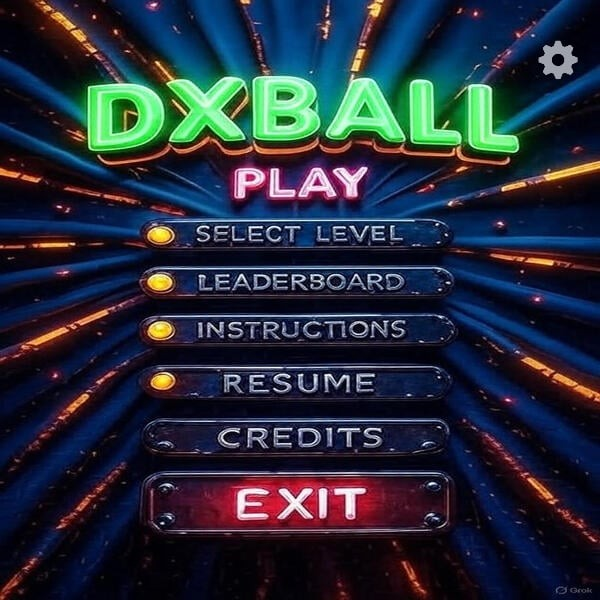
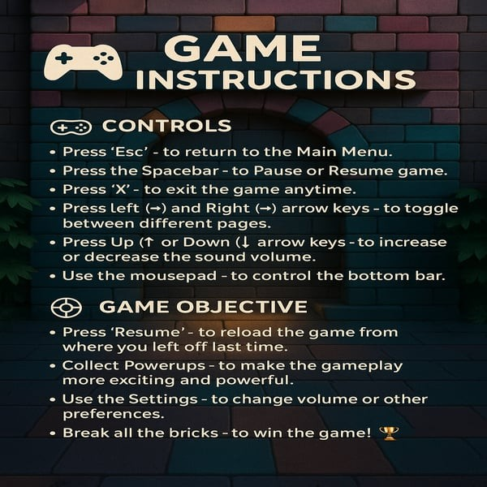
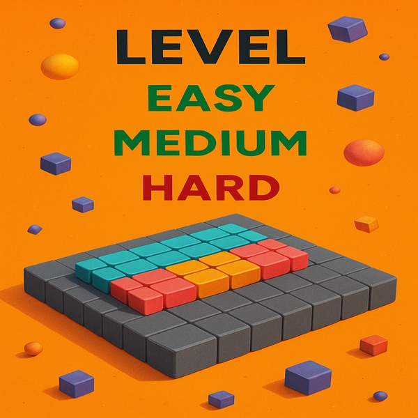
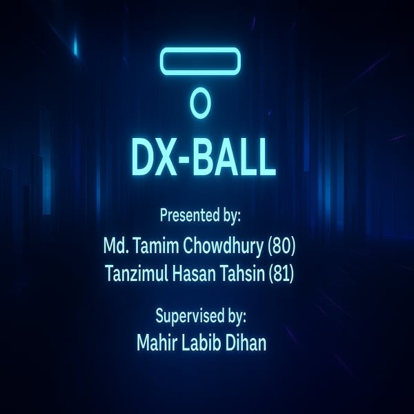

<div align="center">
<h1>DX Ball Game</h1>
</div>

---

Welcome to a stunning new take on the classic DX Ball-style arcade game—modernized for today's PC gamers. With smooth controls, eye-catching visuals, and exciting gameplay mechanics, this game brings a refreshing twist to brick-breaking fun. Whether you're chasing a high score or simply relaxing after a long day, this game is easy to pick up and hard to put down!

🔹 **Game Highlights**  
- **Classic Concept, Modern Look**  
  Break all the bricks on the screen using your paddle and ball! It’s the same nostalgic gameplay you love, now with polished graphics and a sleek design.

- **Challenging Brick Types**  
  - **Yellow Bricks**: Break with just one hit.  
  - **Red Bricks**: Tougher opponents—require two hits to break!  
  Each level brings a fresh layout and more challenging combinations of these bricks.

- **Three Action-Packed Levels**  
  - **Easy**: For relaxed play and beginners.  
  - **Medium**: A balanced challenge.  
  - **Hard**: Only for true brick-breaking masters!  
  As you progress, expect more red bricks and complex brick patterns.

- **Exciting Power-Ups**  
  - Collect **Life Boosters** to gain extra chances.  
  - Grab **Score Boosters** to maximize your points and climb the leaderboard faster!

- **Smooth and Flexible Controls**  
  - Move the paddle using your mouse or **'A'** and **'D'** keys.  
  - Pause anytime with the **spacebar**.  
  - Exit the game easily using the built-in **Exit** button.

- **Smart Resume Feature**  
  - Need a break? No problem. The game remembers where you left off! Just click **“Resume”** next time you open it and continue your progress right from where you stopped.
 


---


<div align="center">
  <h2>Welcome!</h2>
  
</div>

<div align="center">
  <h2>Instructions</h2>
  
</div>

<div align="center">
  <h2>Levels</h2>
  
</div>


<div align="center">
  <h2>Credits</h2>
  
</div>


---

### 🎥 **GamePlay**

- [Youtube Video Link](https://youtu.be/J9kCPZOhV7A?si=nP5pI-Xvn4eHt2Tw)

---

### 🧱 **Setup Instructions**

#### **In Code::Blocks:**

1. Download the ZIP file from [here](https://github.com/mahirlabibdihan/Smash-Bricks-Game/archive/refs/heads/main.zip) and extract it.
2. Open `SmashBricks.cbp` in Code::Blocks. The project is already configured with all the necessary settings. You can directly run the project. By default, the main file is `SmashBricks.cpp`. You can remove it and add a different file if you want.

#### **In Terminal:**

**Download the Game:**

Clone or download the game repository from GitHub:

```bash
git clone https://github.com/mahirlabibdihan/Smash-Bricks-Game.git
cd Smash-Bricks-Game
